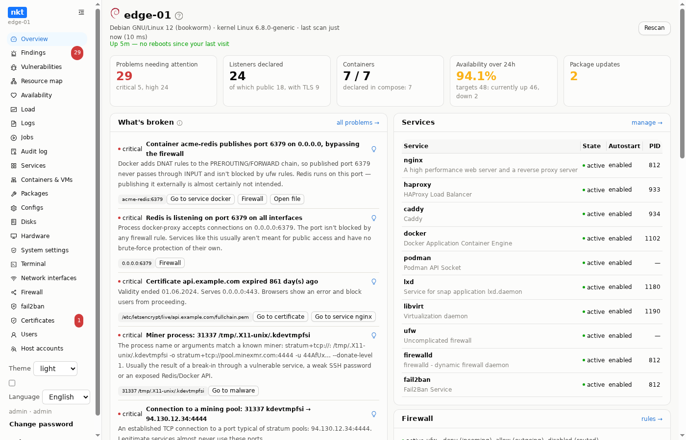
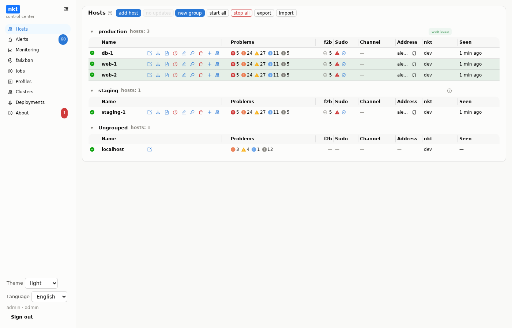
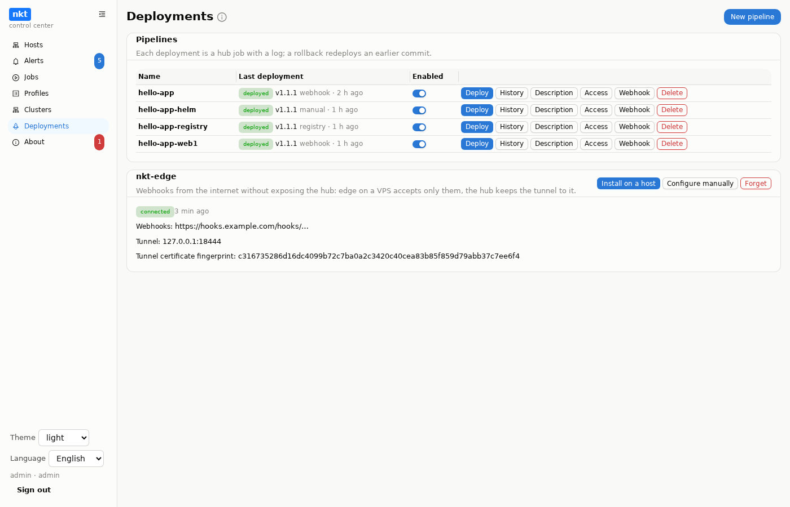

# NetKnownsThat

**English** | [Русский](README.ru.md) | [Site and guide](https://piqab.github.io/nkt/en/)

Looks at a Linux host and answers the question that's usually answered by
hand through half a dozen commands: **what's actually listening on the
network here, does it match the configuration, and what's broken.**

Parses **nginx**, **haproxy**, **Caddy**, **docker/compose**, **podman**,
**LXD**, **libvirt**, **iptables**, **ufw** and **firewalld** — and
cross-checks what it read against what's actually happening on the
machine: `ss` output, packet counters, live containers, a real TLS
connection to the service's own socket. Discrepancies become a list of
problems, the connections between configs become a resource map, and a
history of checks becomes an availability schedule. And it fixes all of
this right there: a config editor with validation and auto-rollback,
services and containers, firewall rules, certificates. The hub manages
many hosts, Kubernetes clusters and deployments from Git.



One static binary (~25 MB), four modes:

```
nkt          web dashboard and background data collection
nkt tui      terminal interface for working over SSH
nkt scan     one-off check, exit code 2 on critical findings
nkt hub      control center for many hosts
```

No Python, no Node, no separate files on the host: the web UI is embedded
in the binary.

## Quick start

**One host** — the binary, a check, the service:

```bash
V=$(curl -fsSL https://api.github.com/repos/piqab/nkt/releases/latest | sed -n 's/.*"tag_name": *"\(.*\)".*/\1/p')
curl -fsSL -o nkt https://github.com/piqab/nkt/releases/download/$V/nkt-linux-amd64 && sudo install -m 0755 nkt /usr/local/bin/nkt
sudo nkt scan
```

Then the systemd service and opening it in a browser —
[Install on a host](https://piqab.github.io/nkt/en/guide/getting-started).

**Many hosts** — the hub in Docker:

```bash
curl -fsSLO https://raw.githubusercontent.com/piqab/nkt/main/deploy/docker-compose.hub.release.yml
docker compose -f docker-compose.hub.release.yml up -d
docker compose -f docker-compose.hub.release.yml logs hub    # admin password
```

systemd and Kubernetes — [Installing the hub](https://piqab.github.io/nkt/en/guide/install-hub).

**Try it without installing** — a snapshot of a real server with planted
problems (Linux, macOS, Windows):

```bash
git clone https://github.com/piqab/nkt.git && cd nkt
make build-dev && NKT_MODE=fixtures ./nkt     # http://127.0.0.1:8077
```

> **Access to nkt equals root on the host.** It listens on `127.0.0.1`
> only; reach it through an SSH tunnel or a reverse proxy with TLS and
> separate authentication — see
> [Ports and access](https://piqab.github.io/nkt/en/guide/ports).





## Documentation

Everything lives on the site, [piqab.github.io/nkt](https://piqab.github.io/nkt/en/):

| Section | What's there |
|---|---|
| [Installation](https://piqab.github.io/nkt/en/guide/getting-started) | a host, [the hub](https://piqab.github.io/nkt/en/guide/install-hub), [ports and access](https://piqab.github.io/nkt/en/guide/ports) |
| [Section guide](https://piqab.github.io/nkt/en/guide/overview) | findings and rule codes, monitoring, services, containers, VMs, Kubernetes, configs, firewall, certificates |
| [Hub](https://piqab.github.io/nkt/en/guide/hub) | [hosts](https://piqab.github.io/nkt/en/guide/hub-hosts), scripts, clusters, alerts, [updates](https://piqab.github.io/nkt/en/guide/hub-updates), [package cache](https://piqab.github.io/nkt/en/guide/hub-cache) |
| [Deployments](https://piqab.github.io/nkt/en/guide/hub-deploy) | pipelines, webhooks, [nkt-edge](https://piqab.github.io/nkt/en/guide/edge), [CI/CD examples](https://piqab.github.io/nkt/en/guide/cicd-examples) for GitHub, GitLab, Gitea |
| [Reference](https://piqab.github.io/nkt/en/guide/reference-config) | every variable, [security](https://piqab.github.io/nkt/en/guide/reference-security), [API](https://piqab.github.io/nkt/en/guide/reference-api), [limitations](https://piqab.github.io/nkt/en/guide/reference-limitations), [troubleshooting](https://piqab.github.io/nkt/en/guide/troubleshooting) |
| [Development](https://piqab.github.io/nkt/en/guide/development) | building, the test stand, tests, code layout |

The full feature list is in [FEATURES.md](FEATURES.md), what changed —
in [WHATSNEW.en.md](WHATSNEW.en.md). The site sources are in
[`site/`](site/); a deployment example is in
[`examples/hello-app`](examples/hello-app).

## License

MIT — [LICENSE](LICENSE). Third-party components keep their own licenses
(noVNC — MPL-2.0, spice-html5 — LGPL-3.0 and others), see
[THIRD_PARTY_NOTICES.en.md](THIRD_PARTY_NOTICES.en.md).
