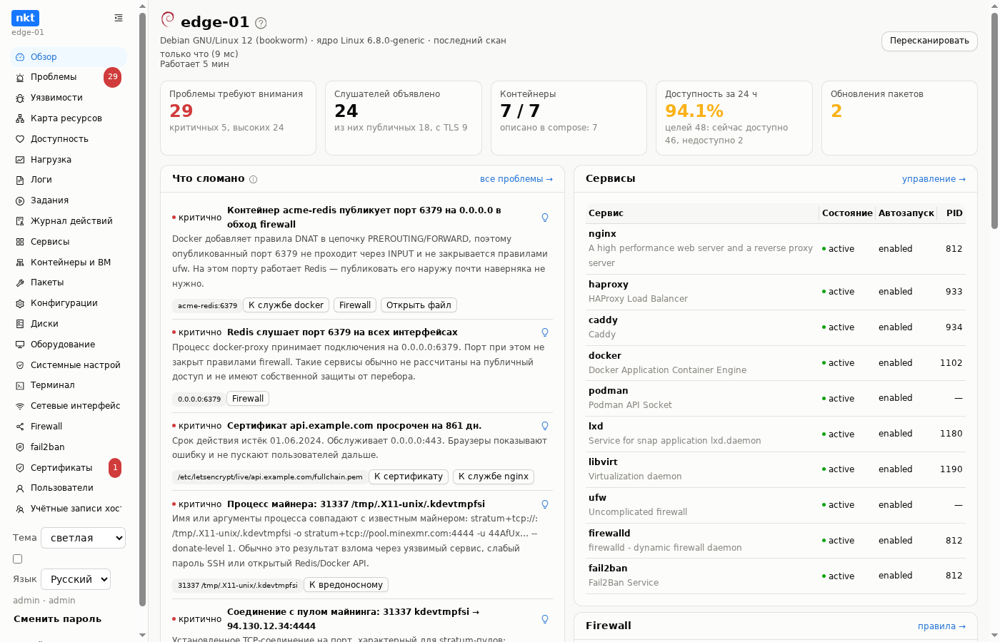
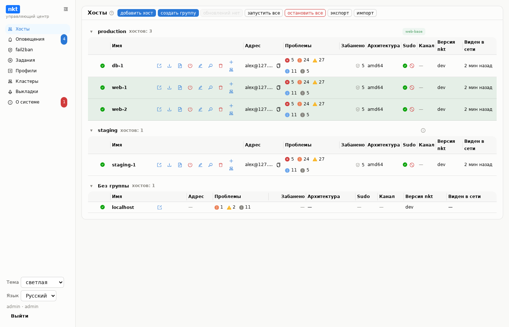
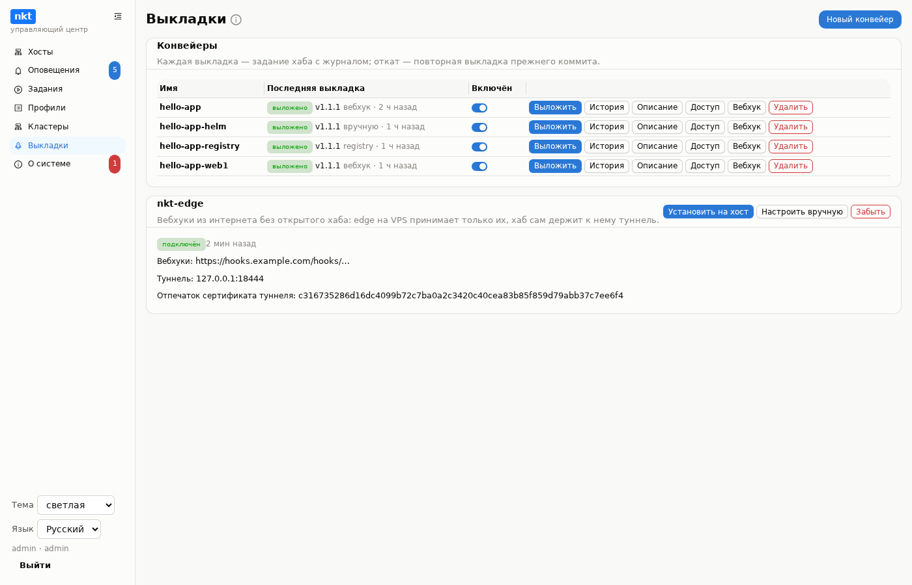

# NetKnownsThat

[English](README.md) | **Русский** | [Сайт и руководство](https://piqab.github.io/nkt/)

Смотрит на Linux-хост и отвечает на вопрос, который обычно решается
вручную полудюжиной команд: **что на самом деле слушает сеть здесь,
совпадает ли это с конфигурацией, и что сломано.**

Разбирает **nginx**, **haproxy**, **Caddy**, **docker/compose**,
**podman**, **LXD**, **libvirt**, **iptables**, **ufw** и **firewalld** —
и сверяет прочитанное с тем, что реально происходит на машине: вывод
`ss`, счётчики пакетов, живые контейнеры, настоящее TLS-соединение к
сокету самого сервиса. Расхождения превращаются в список проблем, связи
между конфигами — в карту ресурсов, а история проверок — в расписание
доступности. И всё это тут же чинится: редактор конфигов с валидацией и
авто-откатом, сервисы и контейнеры, правила firewall, сертификаты. Хаб
управляет многими хостами, кластерами Kubernetes и выкладками из Git.



Один статический бинарник (~25 МБ), четыре режима:

```
nkt          веб-панель и фоновый сбор данных
nkt tui      терминальный интерфейс для работы по SSH
nkt scan     разовая проверка, код выхода 2 при критичных находках
nkt hub      центр управления многими хостами
```

Никакого Python, Node, отдельных файлов на хосте не нужно: веб-интерфейс
встроен в бинарник.

## Быстрый старт

**Один хост** — бинарник, проверка, служба:

```bash
V=$(curl -fsSL https://api.github.com/repos/piqab/nkt/releases/latest | sed -n 's/.*"tag_name": *"\(.*\)".*/\1/p')
curl -fsSL -o nkt https://github.com/piqab/nkt/releases/download/$V/nkt-linux-amd64 && sudo install -m 0755 nkt /usr/local/bin/nkt
sudo nkt scan
```

Дальше — служба systemd и вход из браузера:
[Установка на хост](https://piqab.github.io/nkt/guide/getting-started).

**Много хостов** — хаб в Docker:

```bash
curl -fsSLO https://raw.githubusercontent.com/piqab/nkt/main/deploy/docker-compose.hub.release.yml
docker compose -f docker-compose.hub.release.yml up -d
docker compose -f docker-compose.hub.release.yml logs hub    # пароль администратора
```

systemd и Kubernetes — [Установка хаба](https://piqab.github.io/nkt/guide/install-hub).

**Попробовать без установки** — снапшот настоящего сервера с заложенными
проблемами (Linux, macOS, Windows):

```bash
git clone https://github.com/piqab/nkt.git && cd nkt
make build-dev && NKT_MODE=fixtures ./nkt     # http://127.0.0.1:8077
```

> **Доступ к nkt равносилен root на хосте.** Он слушает только
> `127.0.0.1`; добирайтесь SSH-туннелем или через обратный прокси с TLS и
> отдельной аутентификацией — см.
> [Порты и доступ](https://piqab.github.io/nkt/guide/ports).





## Документация

Всё — на сайте, [piqab.github.io/nkt](https://piqab.github.io/nkt/):

| Раздел | Что там |
|---|---|
| [Установка](https://piqab.github.io/nkt/guide/getting-started) | хост, [хаб](https://piqab.github.io/nkt/guide/install-hub), [порты и доступ](https://piqab.github.io/nkt/guide/ports) |
| [Руководство по разделам](https://piqab.github.io/nkt/guide/overview) | проблемы и коды правил, наблюдение, сервисы, контейнеры, ВМ, Kubernetes, конфигурации, firewall, сертификаты |
| [Хаб](https://piqab.github.io/nkt/guide/hub) | [хосты](https://piqab.github.io/nkt/guide/hub-hosts), сценарии, кластеры, оповещения, [обновления](https://piqab.github.io/nkt/guide/hub-updates), [кэш пакетов](https://piqab.github.io/nkt/guide/hub-cache) |
| [Выкладки](https://piqab.github.io/nkt/guide/hub-deploy) | конвейеры, вебхуки, [nkt-edge](https://piqab.github.io/nkt/guide/edge), [примеры CI/CD](https://piqab.github.io/nkt/guide/cicd-examples) для GitHub, GitLab, Gitea |
| [Справочник](https://piqab.github.io/nkt/guide/reference-config) | все переменные, [безопасность](https://piqab.github.io/nkt/guide/reference-security), [API](https://piqab.github.io/nkt/guide/reference-api), [ограничения](https://piqab.github.io/nkt/guide/reference-limitations), [решение проблем](https://piqab.github.io/nkt/guide/troubleshooting) |
| [Разработка](https://piqab.github.io/nkt/guide/development) | сборка, стенд, тесты, устройство кода |

Полный список возможностей — в [FEATURES.ru.md](FEATURES.ru.md), что
менялось — в [WHATSNEW.md](WHATSNEW.md). Исходники сайта — в
[`site/`](site/), пример выкладки — в
[`examples/hello-app`](examples/hello-app).

## Лицензия

MIT — [LICENSE](LICENSE). Сторонние компоненты — со своими лицензиями
(noVNC — MPL-2.0, spice-html5 — LGPL-3.0 и другие), см.
[THIRD_PARTY_NOTICES.md](THIRD_PARTY_NOTICES.md).
